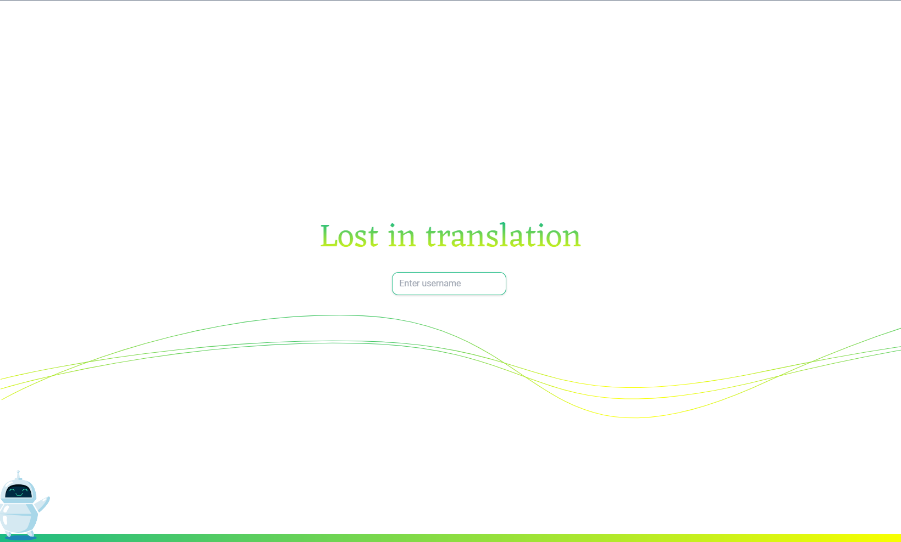
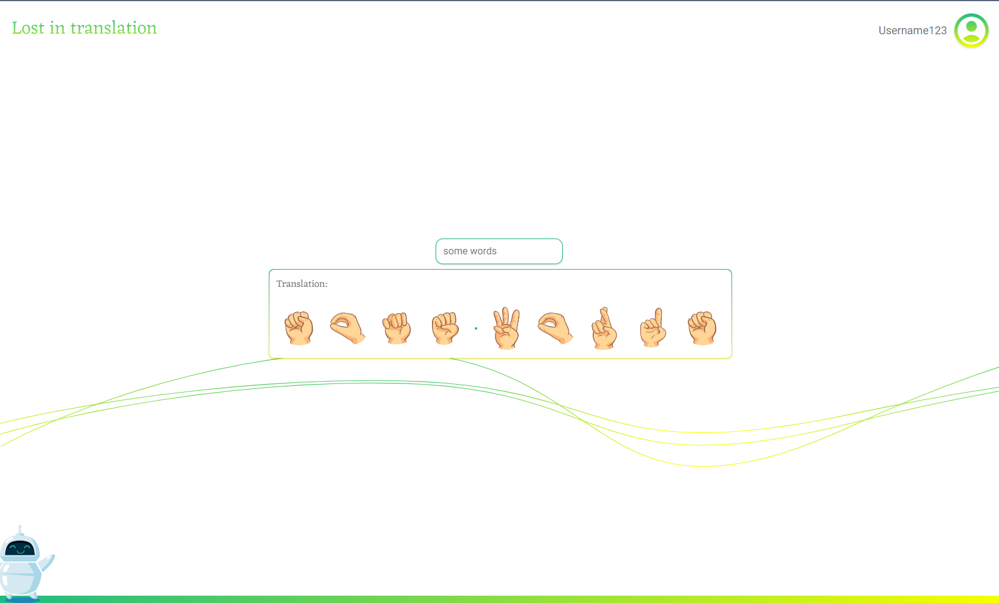
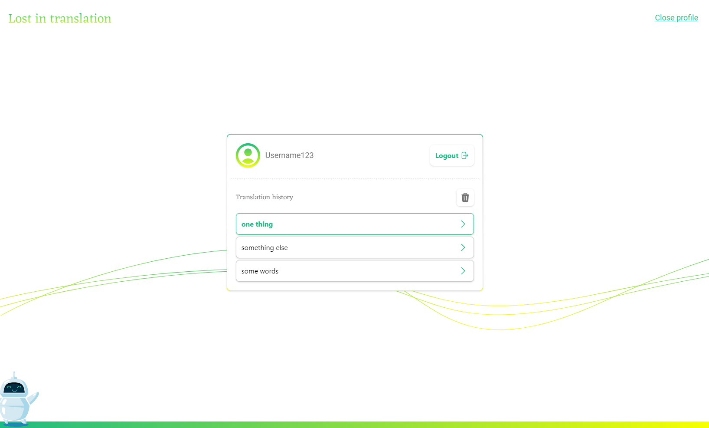

## Overview 

[Link to app](https://taneli1.github.io/ea_assignment_3/)

Application to perform 'translations' from text to sign language. Saves username + translations to the api. 

Built with React using Redux for state management. Styling done with Tailwind CSS. The [json-server api](https://github.com/typicode/json-server) the application communicates with was provided.

[component tree](./docs/component_tree.png)
## Screenshots

